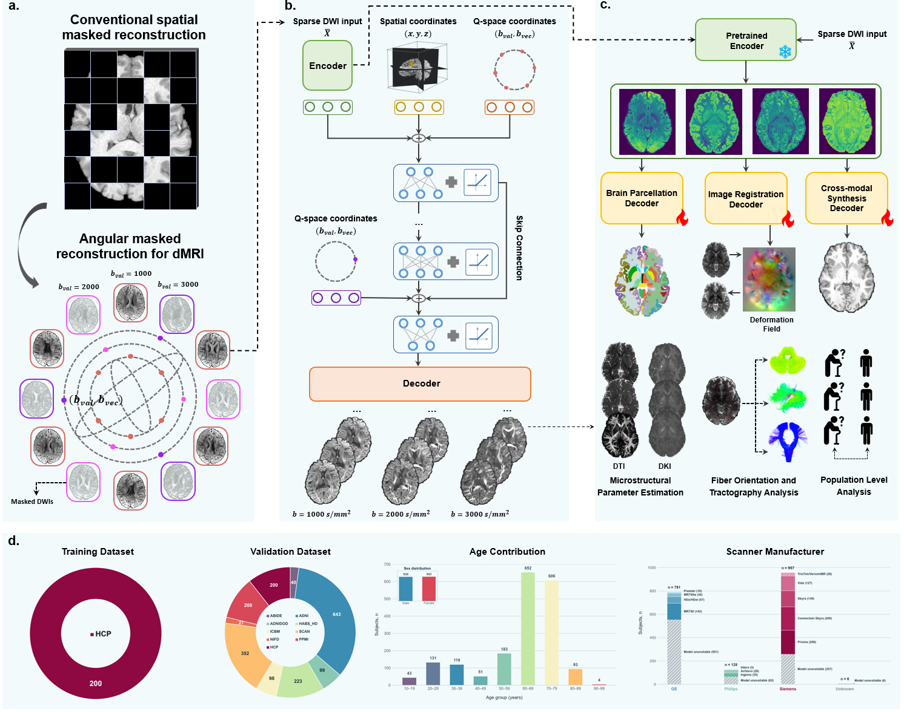
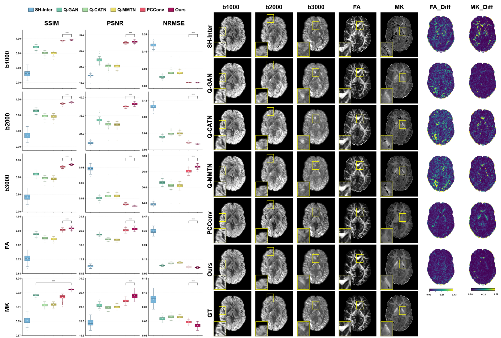
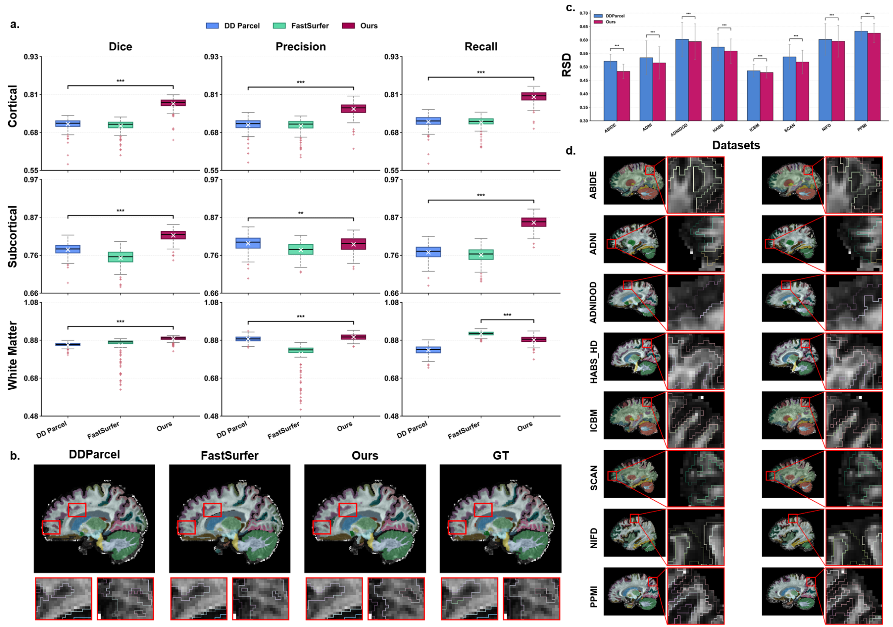
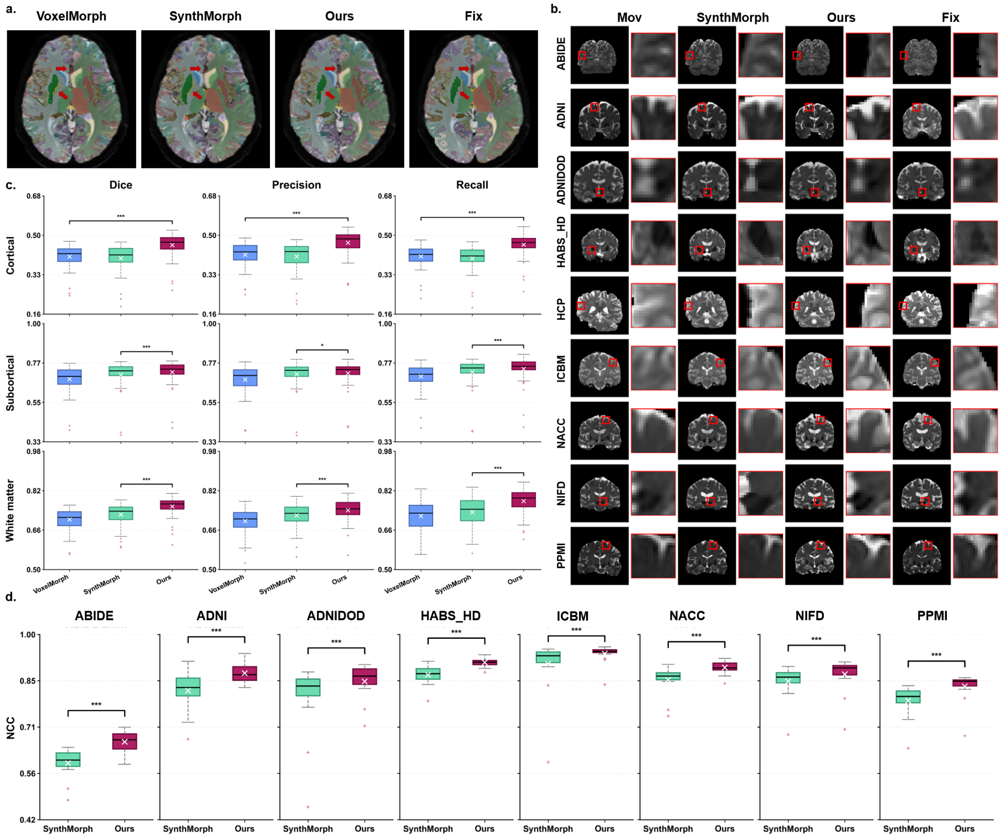
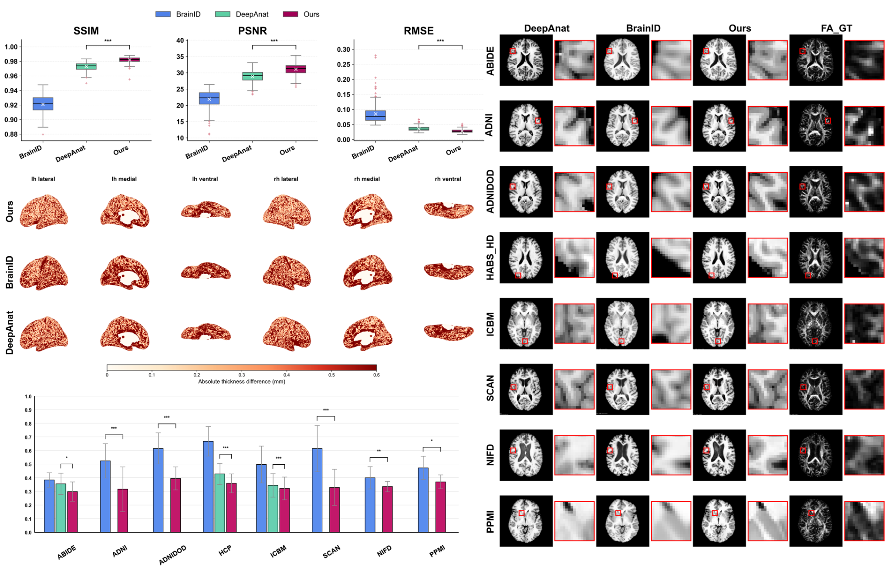

# dMRI-F

## Abstract

Diffusion MRI (dMRI) probes water diffusion within the brain, providing unique information about tissue microstructure and white matter connectivity. High-quality dMRI enables advanced and accurate analyses but demands dense acquisitions, resulting in long scan times and hardware constraints that are often infeasible. Further, dMRI requires dedicated computational methods to support diverse analysis tasks (e.g., parcellation, registration, and synthesis) for both neuroscientific and clinical applications. Here, we present dMRI-F, a foundation model that unifies dMRI data enhancement and downstream tasks across diverse acquisitions and populations, while requiring only minimal acquisition input. dMRI-F is pre-trained with a q-space masked reconstruction task—predicting densely sampled multi-shell data from only six volumes. It learns generalizable latent feature representations of dMRI data, which serve as a core foundation for adapting to diverse downstream tasks including brain parcellation, brain registration, and cross-modal synthesis. Across nine independently acquired datasets, we demonstrate that dMRI-F outperforms state-of-the-art methods with robust generalization across acquisitions, populations, and tasks. Our results demonstrate dMRI-F's versatility as a general-purpose framework that enables diverse dMRI applications from low-cost, sparse acquisitions.

## Method overview

Here, we introduce dMRI-F, a foundation model for dMRI that jointly performs DWI enhancement and learns generalizable latent feature representations, enabling diverse downstream computational tasks across varying acquisition protocols and populations. dMRI-F employs a self-supervised learning (SSL) framework, pre-trained through a q-space masked-reconstruction task that predicts densely sampled multi-shell DWIs from sparse single-shell inputs (Fig. 1a). Architecturally, the model comprises an anatomy-aware encoder that learns latent features reflecting the underlying anatomical structures from input volumes, and a coordinate-conditioned decoder that predicts unseen volumes by jointly modeling these features with DWI spatial and q-space coordinates (Fig. 1b). By generating enhanced, densely sampled data, dMRI-F enables advanced analysis of tissue microstructure and white-matter connectivity from sparse inputs of only six volumes (Fig. 1c). Furthermore, by fine-tuning the learned latent features, dMRI-F enables generalizable adaptation to diverse downstream tasks, including brain parcellation, registration, and cross-modal synthesis (Fig. 1d). Using high-quality data from only 200 HCP-YA subjects for training, dMRI-F achieves robust generalization for DWI enhancement and downstream tasks across various acquisitions and populations (1,882 subjects from the high-quality HCP-YA test set and eight independent test datasets with clinically typical acquisitions) (Fig. 1e). Together, our results demonstrate dMRI-F as a versatile, general-purpose computational framework for dMRI, offering a solid foundation for diverse neuroscientific and clinical applications with minimal acquisition requirements.



## Usage

All entry points read their adjacent `.ymal` configuration file; they do not take command-line arguments. Relative paths in a configuration file resolve from the repository root. Edit the appropriate configuration and its `device` and input/output paths before running a script. The repository does not include image data or trained checkpoints.

Install the PyTorch build appropriate for your CUDA environment, then install the remaining requirements from the repository root:

```bash
python -m pip install -r requirements.txt
```

### Prepare training data

Place each subject's raw 4D DWI NIfTI, `.bval`, `.bvec`, and optional mask under `data/raw/`. Set the filename patterns, shell centers, and output directories in [`dataset.ymal`](dataset.ymal). The default patterns expect `{subject}_denoised.nii.gz`, `{subject}_bval.bval`, `{subject}_bvecs.bvec`, and `{subject}_mask.nii.gz` in the same directory; change them for your acquisitions. The b-values and b-vectors must follow the volume order of the NIfTI. Set `mask_pattern: null` if no mask is available (this uses nonzero signal support, not brain extraction).

```bash
python nii2npy.py
```

This batch conversion writes one `.npy` file per non-b0 DWI to `data/prepared/volumes/` and each subject's mask and shell normalization scales to `data/prepared/metadata/`. To calculate or update only the masks and shell scales from the raw acquisitions, run `python calculate_shell_max.py` with the same `dataset.ymal`.

### Pretrain and generate features

Set data paths, the six-direction checkpoint path, and training options in [`pretraining.ymal`](pretraining.ymal), then run:

```bash
python pretraining.py
```

To extract the 64-channel representation, set `input`, `output`, and the matching pretrained `checkpoint` in [`feature_generate.ymal`](feature_generate.ymal), then run `python feature_generate.py`. Its input is one 4D NIfTI with volume 0 = b0 and volumes 1–6 = DWI. The output is a 4D feature NIfTI in the input image space.

### Predict additional DWI volumes

In [`inference.ymal`](inference.ymal), set `b0` (one b0 volume), `source_dwi` (six DWI volumes without b0), `source_bvals`, `source_bvecs`, `target_bvals`, `target_bvecs`, `checkpoint`, and `output`. The source and target gradient files must match their respective volume counts; the target gradient files define the requested output directions and b-values. Run:

```bash
python inference.py
```

The output NIfTI contains the input b0 as its first volume, followed by one predicted DWI per target gradient. Matching `.bval` and `.bvec` files are written beside it. The checkpoint must have been trained with the configured six source directions.

### Downstream tasks

Each task has its own training and inference configuration. The parcellation and T1w synthesis inference scripts each accept one 4D NIfTI ordered as b0 + six DWIs. Training additionally requires aligned task targets and the files named in the corresponding training configuration.

| Task | Training | Inference | Inference output |
| --- | --- | --- | --- |
| Brain parcellation | [`downstream_parc_train.ymal`](downstream_parc_train.ymal) → `python downstream_parc_train.py` | [`downstream_parc_inference.ymal`](downstream_parc_inference.ymal) → `python downstream_parc_inference.py` | 3D label NIfTI |
| T1w synthesis | [`downstream_syn_train.ymal`](downstream_syn_train.ymal) → `python downstream_syn_train.py` | [`downstream_syn_inference.ymal`](downstream_syn_inference.ymal) → `python downstream_syn_inference.py` | 3D normalized T1w NIfTI |
| Registration | [`downstream_reg_train.ymal`](downstream_reg_train.ymal) → `python downstream_reg_train.py` | [`downstream_reg_inference.ymal`](downstream_reg_inference.ymal) → `python downstream_reg_inference.py` | Displacement field and warped moving b0 NIfTIs |

Registration inference takes moving and fixed 64-channel feature NIfTIs in a common voxel grid, plus the moving b0 aligned to its feature image. Generate features with `feature_generate.py` for each b0 + six-DWI input first. Set `moving_feature`, `fixed_feature`, `moving_b0`, `flow_output`, and `warped_b0_output` in its configuration.

## Results

**DWI enhancement.** Reconstruction and derived microstructural maps on the HCP-YA benchmark (paper Fig. 2).



**Brain parcellation.** Segmentation comparisons and performance across acquisitions (paper Fig. 6).



**Inter-subject registration.** Alignment comparisons and cross-dataset evaluation (paper Fig. 7).



**T1w synthesis.** Synthesized anatomical images and quantitative comparisons (paper Fig. 8).


